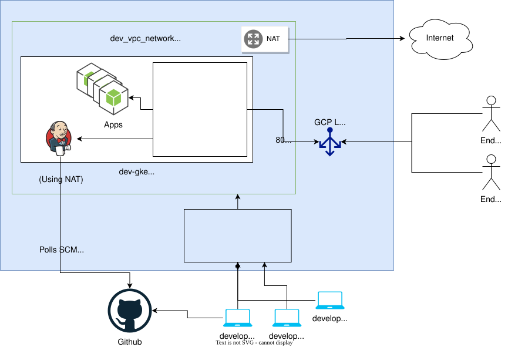

# Gorilla Logic DevOps test

## Table of Contents  
  - [Table of Contents](#table-of-contents)
  - [Summary](#summary)
  - [Architecture](#architecture)
  - [Infrastructure as Code](#infrastructure-as-code)
  - [Kubernetes](#kubernetes)
  - [Continuous Integration & Continuous Deployment](#continuous-integration--continuous-deployment)
  - [Artifacts](#artifacts)
  - [Improvements](#improvements)

## Summary
This repo contains the necessary code to deploy the Gorilla Logic DevOps test, which encourages people to use best practices to deploy an application to an environment that's fully automated, scalable, high available and reliable.

**Note:** Due to the ammount of testing done, using the real Let'sEncrypt server, domain snwbr.net got blocked a couple of times. At the time of reading, sites such as https://snwbr.net/jenkins/ or https://snwbr.net/timeoff/ may present you an invalid cert, that if you check using Chrome, it will show you it's not invalid, but using Let'sEncrypt staging servers (which is the one should be used for development purposes). Real certificates can be enabled by changing `name: ingress-staging` to `name: ingress` in file [certificate.yaml](k8s/services/traefik/base/certificate.yaml), commit, push to `main` and it will be applied by Jenkins.

## Architecture
### Toolset and technologies

- Cloud provider: Google Cloud
- Infrastructure as Code: Terraform
- CI/CD: Jenkins
- K8s teamplating: kustomize
- K8s installation manager: Helm
- Reverse proxy, routing, service discovery and TLS termination: Traefik
- K8s CNI: Calico
- Certificates management: Cert-manager
- Domain provider: Google Domains

### High level architecture diagram

### Highlights and motivation
The challenge was split into two different repos:
- https://github.com/snwbr/gl-test/ (this repoo) contains all the base code to configure the cloud of chosing, to spin up the environment and handle underlaying objects required for the app to be deployed and run successfully. For details, read the sections below.
- https://github.com/snwbr/timeoff-management-application/ is an actual application to be build, tested and deployed over the environment previously configured.

## Infrastructure as Code

For creating objects in the cloud, Terraform was chosen. Terraform code is splitted by enviornments (see the [README](terraform/README.md)).

Terraform manages the construction of the Virtual Private Network, as well as the Identity-Aware Proxy (Cloud IAP) to connect from remote locations to the private network resources. Also, the GCP project's API are managed through Terraform. Rest of objects (firewall rules, dns names, NAT, routers, service accounts, etc) are part of it.

## Kubernetes

During this challenge, Google Kubernetes Enginer (GKE) was chosen. The configuration is as follows:
- Private cluster, with no direct access to internet (no node has public IP).
- Node autoscaling is enabled, for High Availability.
- Terraform-managed nodepool.
- Ingress is served through Traefik with Custom Resource Definitions (CRDs).
- One Traefik service using a public IP through a LoadBalancer K8s service which is the only source of access to K8s services.
- Internet access is provider at VPC level through a Router using NAT.
- SSL Certificates for jenkins and other applications are managed trhough cert-manager, auto-renewing when needed.
- Services and pods interconnections is done through internal routing and DNS.
- Addition of Horizontal Pod Autoscaling to Traefik to support high loads.

## Continuous Integration & Continuous Deployment

JenkinsCI is used under its native [Kubernetes Operator mode](https://jenkinsci.github.io/kubernetes-operator/docs/). This has some advantages:
- New Jenkins CRDs are created.
- The operator creates a jenkins controller instance, 100% configurable through code.
- The Jenkins controller spins up and manages all the jenkins agents as pods, as if they were real nodes. Such pods are deleted at the end of the run.
- Credentials are synched from K8s secrets objects, discovered through annotations.
- Jenkins operator supports groovy, Jenkins DSL and creation of seed jobs at start time.

Jenkins runs mainly during two important SDLC phases:
- **Git push to branch:** Jenkins listens to the repos and build every push to the monitored branches.
  - If the branch that gets the push (or merge) event is "main", Jenkins will not only run the CI pipeline (build, validate and test) but the CD pipeline as well (deploy the code to K8s).
- **Pull requests creation:** Jenkins detects any pull request created, gheckouts the pull request data and locally merges it with "main", then it runs the CI pipeline. Results of the run are reported back to Github to decision on whether or not to merge into "main".

Jenkins URL is https://snwbr.net/jenkins/.

## Artifacts

The main artifacts created by Jenkins are K8s yaml manifests and docker images.

## Improvements

To stick to the challenge request and deliver it on time, a good ammount of good practices were not done, but they're not heavily required for a demo purpose. Still though, they're listed here as things I would improve to this solution:

- Addition of proper liveness and readiness probes to K8s deployments (timeoff app is very old and doesn't have healthchecks defined on the JS code).
- Creation a secret management tool such as Vault.
- Split Terraform code from K8s into different repositories to be able to manage them through different access controls and strategies.
- Introduce security vulnerabilities scan to generated docker images.
- Added some lint rules to code (SonarQube perhaps).
- Implementing monitoring and alerting to the stack (through Prometheus & Grafana or New Relic if there is a license for that).
- Adding a logging stack, either EFK or stackdriver metrics (because it's in Google).
- Configure apps and/or managed objects using ansible.
- Adding Atlantis for TF plan/apply via Github PRs (and achieve true GitOps).
- Creation of granular RBAC rules through all the tools and processes.
